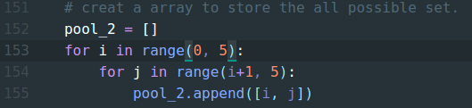
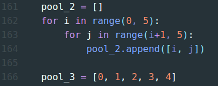

# ALGO_HW2

### 程式
* ```python3 algorithm_HW2_b.py``` ----> 2*5 #C game
* ```python3 algorithm_HW2_e.py``` ----> 2*n (def:6) #C game
* ```python3 algorithm_HW2_g.py``` ----> 2*5 #C game (expected number)
* ```python3 algorithm_HW2_j.py``` ----> 2*n (def:6) #C game (expected number)

### 執行
* 終端機 ```cd``` 到程式資料夾下  
* 輸入  ```python3 algorithm_HW2_b.py``` 或 ```python3 algorithm_HW2_e.py```、```python3 algorithm_HW2_g.py```、```python3 algorithm_HW2_j.py```
* 出現程式視窗

### 回答  
* ```2c``` = Both two number are correct.
* ```1c``` = Only one number is correct.
* ```0c``` = Both two number are wrong.
* 輸入完按按鈕 ```Submit```

### 重新
* 當成功猜到數字後 ```RE``` 的按鈕會出現，按下即可重新開始


### 2*N #C game


```python3 algorithm_HW2_e.py``` ----> 2*n (def:6) #C game

* 要改成 T(n)，在 ```algorithm_HW2_e.py``` 的 153 行跟 154 行把 for 迴圈改成 ```for i in range(0, n)``` 與 ```for i in range(i+1, n)```。



```python3 algorithm_HW2_j.py``` ----> 2*n (def:6) #C game (expected number)

* 要改成 T(n)，在 ```algorithm_HW2_j.py``` 的 162 行跟 163 行把 for 迴圈改成 ```for i  in range(0, n)``` 與 ```for i in range(i+1, n)``` 與 166 行的 pool_3 改成 ```pool_3 = [0, 1, 2, 3, 4, 5]``` 看 N 要多少。
