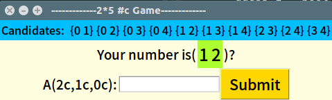
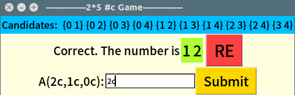

# ALGO_HW2

### 執行
* 終端機 ```cd``` 到程式資料夾下  
* 輸入  ```python3 algorithm_HW2.py```
* 出現程式視窗

### 回答  
* ```2c``` = Both two number are correct.
* ```1c``` = Only one number is correct.
* ```0c``` = Both two number are wrong.
* 輸入完按按鈕 ```Submit```

### 重新
* 當成功猜到數字後 ```RE``` 的按鈕會出現，按下即可重新開始

